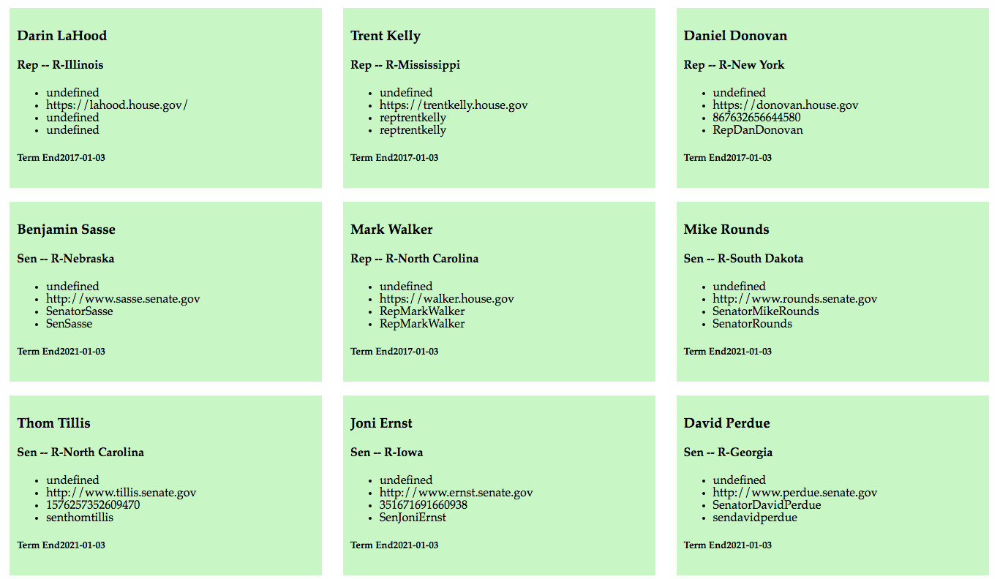

#Intro-APIs

##Objectives

  - Read and explore the documentation of APIs
  - Effectively implement Promise/Deferred objects
  - Format retrieved data into HTML

##Instructions

* Clone the repo at https://github.com/magentanova/intro-to-apis into a folder on your own hard drive.
* Change the remote url with `git remote set-url origin <url for your remote repo>` (so it points to a repo on your github account, not your instructor's.) 
* Write code in main.js that will retrieve data on legislators from the [Sunglight Foundation's congress API](https://sunlightlabs.github.io/congress/) and display it on a web page.

###Normal Mode

Retrieve data on all legislators, reproducing the page shown below: 

###Adventure Mode

Include a text input at the top of your page. If the user enters a ZIP code and types enter, your app should retrieve data on local legislators. See gif below: 

##Deliverables 

A link to a live site on gh-pages showcasing your work.
